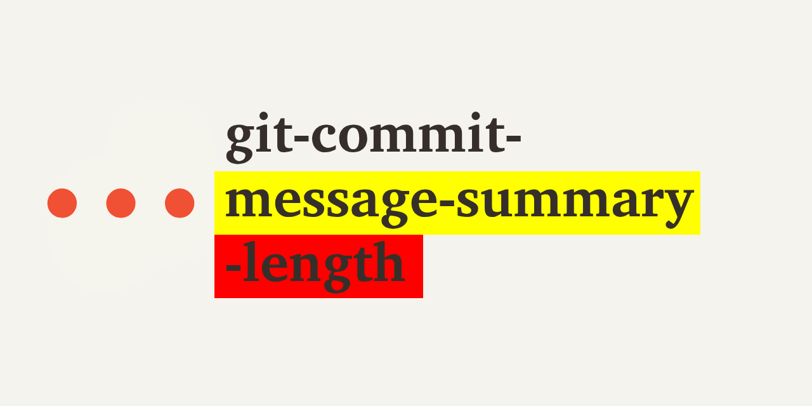

# git-commit-message-summary-length  

**git-commit-message-summary-length**: Check the length of a commit message's first line.



## In a nutshell

&nbsp;

> [!TIP]
> &nbsp;
> Check out the full docs at https://git-commit-message-summary-length.olets.dev
> &nbsp;

&nbsp;

```shell
git commit-message-summary-length [--error-after=<length>] [--log-level=<log level>] [--warn-after=<length>] [<revision>]
```

Succeeds if the commit message summary's length is less than or equal to the "error after" length (default 72).

Fails if the commit message summary's length is greater than the "error after" length (default 72).

`revision` (default `HEAD`) is any [revision](https://git-scm.com/docs/gitrevisions) parameter accepted by `git log -1`.

If the log level (default `3`)

- is `0`, the command has no output.

- is `1`, the integer length of the commit message is logged.

- is `2`, the length of the commit message is logged in a sentence, colored yellow if the commit message summary's length is between "warn after" (default 50) and "error after" (default 72) characters long, or colored red if the message is more than "error after" (default 72) characters long.

- is `3`,
    - as with log level `2`, the length of the commit message is logged in a sentence, colored yellow if the commit message summary's length is between "warn after" (default 50) and "error after" (default 72) characters long, or colored red if the message is more than "error after" (default 72) characters long,
    - and the commit message is logged, with characters after "warn after" and up to "error after" highlighted in yellow, and characters after "warn after" highlighted in red.

## Changelog

See the [CHANGELOG](CHANGELOG.md) file.

## Contributing

Thanks for your interest. Contributions are welcome!

> Please note that this project is released with a [Contributor Code of Conduct](CODE_OF_CONDUCT.md). By participating in this project you agree to abide by its terms.

Check the [Issues](https://github.com/olets/git-commit-message-summary-length/issues) to see if your topic has been discussed before or if it is being worked on.

Please read [CONTRIBUTING.md](CONTRIBUTING.md) before opening a pull request.

## License

<a href="https://www.github.com/olets/git-commit-message-summary-length">git-commit-message-summary-length</a> by <a href="https://olets.dev">Henry Bley-Vroman</a> is, with the exception of its logo as covered below, licensed under a license which is the unmodified text of <a href="https://creativecommons.org/licenses/by-nc-sa/4.0">CC BY-NC-SA 4.0</a> and the unmodified text of a <a href="https://firstdonoharm.dev/build?modules=eco,extr,media,mil,sv,usta">Hippocratic License 3</a>. It is not affiliated with Creative Commons or the Organization for Ethical Source.

Human-readable summary of (and not a substitute for) the [LICENSE](LICENSE) file:

You are free to

- Share — copy and redistribute the material in any medium or format
- Adapt — remix, transform, and build upon the material

Under the following terms

- Attribution — You must give appropriate credit, provide a link to the license, and indicate if changes were made. You may do so in any reasonable manner, but not in any way that suggests the licensor endorses you or your use.
- Non-commercial — You may not use the material for commercial purposes.
- Ethics - You must abide by the ethical standards specified in the Hippocratic License 3 with Ecocide, Extractive Industries, US Tariff Act, Mass Surveillance, Military Activities, and Media modules.
- Preserve terms — If you remix, transform, or build upon the material, you must distribute your contributions under the same license as the original.
- No additional restrictions — You may not apply legal terms or technological measures that legally restrict others from doing anything the license permits.

## Related

I've created other command line tools, including other Git tools. Check them out at <https://olets.dev/software/>.
